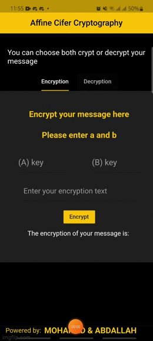

# Affine Cipher Cryptography
The Affine Cipher Cryptography App is a beautiful and user-friendly mobile application developed using Flutter. It provides a secure and efficient way to encrypt and decrypt messages using the Affine Cipher algorithm, a type of substitution cipher.

## How It's Made:

**Tech used:** Flutter, Dart

The Affine Cipher Cryptography App is built using the Flutter framework, allowing for cross-platform development of mobile applications. Here's an overview of the technologies and techniques used in the project:

Flutter: The entire app is developed using the Flutter framework, which provides a rich set of UI components and tools for building beautiful and performant mobile applications.

Dart: The programming language used in the Flutter framework is Dart. Dart's simplicity and powerful features allow for efficient development and easy maintenance of the app.

Affine Cipher Algorithm: The app implements the Affine Cipher algorithm, which is a substitution cipher that combines modular arithmetic and linear functions to encrypt and decrypt messages. The algorithm provides a secure way to transform plaintext into ciphertext and vice versa.

The app includes features such as message encryption and decryption, customizable encryption keys, and a user-friendly interface for seamless interaction with the Affine Cipher cryptography functionality.

## Optimizations

While developing the Affine Cipher Cryptography App, I implemented several optimizations to improve its performance and user experience:

Efficient Encryption and Decryption: The Affine Cipher algorithm is optimized for fast encryption and decryption of messages. I ensured that the implementation is efficient and does not introduce unnecessary delays, providing a smooth experience for users.

UI Responsiveness: The app's user interface is designed to be responsive and provide real-time feedback to users. I optimized UI components and animations to ensure smooth transitions and a seamless user experience.

Error Handling: Robust error handling mechanisms are implemented to handle various scenarios, such as invalid inputs or unexpected errors. Users are provided with clear and informative error messages, enhancing the reliability of the app.

Code Optimization: Throughout the development process, I optimized the codebase by eliminating redundant code, improving algorithms, and following Flutter's best practices. These optimizations enhance the app's performance and maintainability.

These optimizations contribute to an efficient and user-friendly experience, ensuring that the Affine Cipher Cryptography App delivers accurate and secure encryption and decryption functionality.

## Lessons Learned:

Developing the Affine Cipher Cryptography App provided valuable learning experiences and helped me enhance my skills as a mobile app developer. Here are some key lessons I learned:

Flutter Development: Building the app using Flutter expanded my knowledge and proficiency in mobile app development. I gained expertise in working with Flutter's widget system, state management, navigation, and UI/UX design.

Cryptography Concepts: Implementing the Affine Cipher algorithm deepened my understanding of cryptography concepts, such as substitution ciphers and encryption techniques. I gained insights into the importance of secure communication and data protection.

Optimization Techniques: The project emphasized the significance of performance optimization techniques, such as efficient algorithms, UI responsiveness, and error handling. I learned how to identify bottlenecks and optimize code for better user experience.

UI/UX Design: Designing a beautiful and user-friendly interface helped me refine my skills in UI/UX design principles, including layout design, color schemes, typography, and usability considerations.

## Examples:
Here are a few examples of other projects I have worked on:

**Affine Cifer Crypto:** https://github.com/ba-beker/Affine_Cifer_Crypto

**Push Swap :** https://github.com/ba-beker/push_swap

**Socket Communication Server  :** https://github.com/ba-beker/socket-communication-server

Feel free to explore these projects to get a better understanding of my range of skills and coding style.

If you have any questions or would like to discuss this project further, please feel free to contact me. Thank you for taking the time to review my work!

